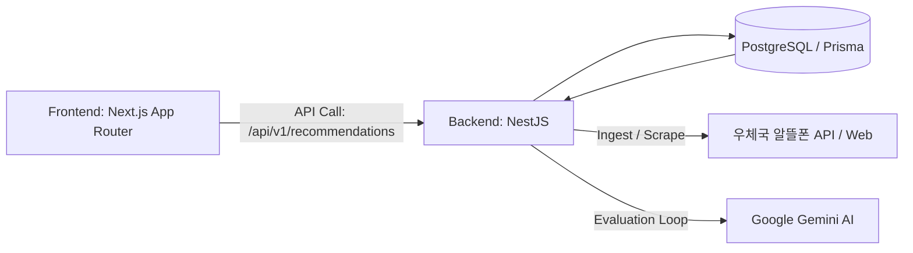

<div align="center">

# 📱 Project YOGI
**알뜰폰 요금제 AI 맞춤 추천 플랫폼**


*"사용자의 통신비를 진단하고 최적의 알뜰폰 요금제를 AI가 즉시 제안하는 극도의 심리스(Seamless) 서비스"*

</div>

---

## 🎯 프로젝트 주요 목표 (Project Goals)

- **비회원 기반 극도의 심리스 UX (Seamless UX)**: 대시보드나 복잡한 회원가입 없이, 접속 즉시 폼을 입력하고 추천 결과를 확인하는 단일 페이지(Single-Flow) 레이아웃.
- **AI 정밀 큐레이션**: LLM(Gemini)을 활용해 사용자의 현재 데이터/통화량과 무제한 여부 등의 선호도를 분석하고, 가장 경제적인 **TOP 3 알뜰폰 요금제**를 맞춤 추천합니다.
- **Data-centric 파이프라인**: 우체국 알뜰폰 크롤링 및 API 데이터를 가공하여 DB에 적재하며, AI 프롬프트를 데이터로 격리(Markdown)하여 런타임 안정성을 높입니다.
- **강력한 회복 탄력성 (Resilience)**: 외부 API 장애 및 LLM 응답 지연(20초 타임아웃) 시 스켈레톤 UI와 목업(Mock) 데이터로 안전하게 Fallback 렌더링을 보장합니다.

---

## 🏗️ 시스템 아키텍처 개요 (Architecture)

본 프로젝트는 **모노레포(Monorepo)** 구조로 프론트엔드와 백엔드가 완벽하게 분리된 채 통합 구동됩니다.



- **Frontend (`/frontend`)**: RSC(React Server Components)를 적극 활용한 Next.js App Router 아키텍처. Tailwind v4와 shadcn/ui 기반의 모바일 퍼스트 반응형 UI 구현.
- **Backend (`/backend`)**: NestJS 기반의 3계층 아키텍처. Prisma ORM 트랜잭션으로 사용자 익명 세션(`input_id`)을 관리하며, 스케줄러(`telemetry`)를 통해 매일 새벽 요금제 데이터를 동기화합니다.

---

## 🚀 시작하기 (Getting Started)

프로젝트를 로컬 환경에서 구동하기 위한 가이드입니다.

### 1. 사전 요구 사항 (Prerequisites)
- Node.js v18 이상
- PostgreSQL (로컬 또는 클라우드 DB)
- Google Gemini API Key

### 2. 프로젝트 설치 및 환경 설정
루트 폴더에서 아래 명령어를 통해 프론트엔드와 백엔드 패키지를 일괄 설치합니다.
```bash
# 전체 의존성 설치 (루트, backend, frontend)
npm run install:all
```

### 3. 환경 변수 설정 (.env)
백엔드 루트(`backend/`)와 프론트엔드 루트(`frontend/`) 경로에 각각 `.env`와 `.env.local` 파일을 직접 생성하여 다음과 같이 환경 변수를 세팅하세요.

- **`backend/.env`**: `DATABASE_URL`, `EXTERNAL_PLAN_API_URL`, `EXTERNAL_PLAN_API_KEY`, `GEMINI_API_KEY` 등이 기입되어야 합니다.
- **`frontend/.env.local`**: `NEXT_PUBLIC_API_URL=http://localhost:3002/api` (프론트엔드 `api.ts`에서 `/v1`을 자동 결합합니다)

### 4. 데이터베이스 세팅 및 초기 데이터 수집
서버를 실행하기 전, Prisma를 통한 DB 동기화와 외부 요금제 데이터 스크래핑이 필수입니다.
```bash
cd backend

# DB 스키마 동기화 및 Prisma Client 생성
npx prisma db push
npx prisma generate

# 우체국 알뜰폰 초기 요금제 데이터 및 크롤러 기반 URL 적재
npm run telemetry:ingest
cd ..
```

### 5. 로컬 서버 실행
`concurrently`를 통해 프론트엔드(포트: 3001)와 백엔드(포트: 3002) 개발 서버가 동시에 실행됩니다.
```bash
npm run dev
```
- Frontend: `http://localhost:3001`
- Backend: `http://localhost:3002`

---

## 📡 API 엔드포인트 핵심 명세

비회원 다형성 세션 처리를 위해 프론트엔드는 항상 `X-Session-ID` 헤더를 전송하여 익명 사용자를 식별합니다.

| Method | Endpoint | Description |
|---|---|---|
| `POST` | `/api/v1/recommendations` | 사용자 진단(사용량, 통신사) 접수 및 AI 요금제 추천 비동기 요청 (`input_id` 발급) |
| `GET` | `/api/v1/recommendations/:input_id` | 발급된 `input_id`를 통해 AI 추천 요금제 TOP 3와 분석 사유 결과 조회 |
| `GET` | `/api/v1/plans` | 전체 알뜰폰 요금제 DB 및 상세 조회 (망/통신사/가격 필터링) |

---

## 🧪 테스트 가이드 (Testing)

Project YOGI는 높은 품질 보증을 위해 Vitest와 Supertest를 결합한 철저한 모의(Mock) 통합 테스트를 수행합니다.

### 백엔드 테스트 (Backend)
```bash
cd backend

# 1. 단위 테스트 및 로직 검증 (Vitest)
npm run test

# 2. 커버리지 확인
npm run test:cov

# 3. Supertest 통합 API 시나리오 검증 (E2E)
npm run test:e2e
```
> **Tip:** 백엔드 테스트는 `antigravity/mocks/` 폴더의 결함 데이터를 활용하여 우체국 알뜰폰 API 호출 실패 시 지수 백오프(Exponential Backoff) 및 자가 치유(Self-healing) 로직이 정상 작동하는지를 포함해 검증합니다.

---

## 🛠️ 개발 및 기여 가이드라인

개발에 참여하시거나 코드를 수정하실 때는 다음 폴더 구조와 문서를 참고해 주세요.

```text
project_yogi/
├── frontend/                  # Next.js 클라이언트 및 UI 로직
├── backend/                   # NestJS 서버, AI 파이프라인 및 크롤러
│   ├── src/telemetry/         # 📌 우체국 데이터 수집 및 크롤링 (npm run telemetry:ingest)
│   ├── src/recommendations/   # 📌 AI 추천 서비스 로직
│   └── prisma/                # DB 스키마 및 마이그레이션 파일
└── antigravity/               # ⚠️ 프로젝트 코어 AI 에이전트 지침 및 프롬프트
    ├── orchestration_master.md # 프로젝트 마일스톤 및 체크리스트
    ├── frontend_instructions.md# 프론트엔드 룰셋
    ├── backend_instructions.md # 백엔드 룰셋
    ├── harness.yaml           # CI/CD 및 파이프라인 검증 룰셋
    ├── mocks/                 # 장애 대응 테스트용 모의 데이터
    └── prompts/               # AI (Gemini) 프롬프트 템플릿 마크다운 파일
```

> **AI 에이전트 지침**: 코드 베이스 수정 전 반드시 `antigravity/orchestration_master.md`를 읽고 전체 아키텍처 규칙과 렌더링 컨텍스트를 파악해야 합니다.

---

## 🛠️ 트러블슈팅 (Troubleshooting)

프로젝트 개발 및 테스트 과정에서 발생한 주요 문제들과 해결 방안입니다. 전체 내역은 `antigravity/troubleshooting.md`에서 확인할 수 있습니다.

<details>
<summary><b>1. 아코디언 애니메이션과 Scroll-Driven 동기화 이슈</b></summary>
- <b>문제</b>: 로딩 지연이 없는 경우 아코디언이 처음부터 열린 상태로 마운트되어 트랜지션이 발생하지 않고, ResizeObserver 스크롤 추적 로직이 미작동.<br/>
- <b>해결</b>: 마운트 직후 `setTimeout`(50ms)을 주어 브라우저가 강제로 0fr -> 1fr 트랜지션을 그리도록 유도하여 해결.
</details>

<details>
<summary><b>2. 잘못된 UUID 파라미터로 인한 500 에러</b></summary>
- <b>문제</b>: 폼 제출 직후 라우팅 시 `input_id=undefined`가 넘어가 백엔드 Prisma 예외 발생.<br/>
- <b>해결</b>: 백엔드 파라미터에 `ParseUUIDPipe({ version: '4' })` 부착하여 400 에러로 방어 및 프론트엔드 라우팅 조건문 강화.
</details>

<details>
<summary><b>3. JSDOM 환경 Chart.js 및 ResizeObserver 에러 (Vitest)</b></summary>
- <b>문제</b>: `vitest` 실행 시 실제 브라우저가 아니라 Canvas API와 ResizeObserver 지원이 안되어 에러 발생 및 DOM 오염 누적.<br/>
- <b>해결</b>: `vitest.setup.ts`에 `react-chartjs-2`를 Mocking 처리하고 `ResizeObserver` 더미 클래스 할당. `afterEach(cleanup)`을 통해 DOM 격리 보장.
</details>

<details>
<summary><b>4. Next.js Error Overlay 강제 노출 현상</b></summary>
- <b>문제</b>: 503 에러를 catch하여 UI 배너를 띄웠으나, Next.js 개발 모드의 Error Overlay가 강제로 화면을 덮음.<br/>
- <b>해결</b>: catch 블록 내부의 `console.error(err)` 라인을 제거하여 프레임워크가 가로채지 않고 정상적인 UI 배너만 렌더링되도록 수정.
</details>

<details>
<summary><b>5. CSS Grid 요소 호버 시 테두리 잘림 현상</b></summary>
- <b>문제</b>: 요금제 카드 호버 확대 시(`scale-[1.02]`), 부모 요소의 `overflow-hidden` 때문에 가장자리가 칼로 자른 듯 잘림.<br/>
- <b>해결</b>: 바깥쪽 레이아웃 패딩(`px-4`)을 안쪽 컨테이너로 이동하여 카드 팽창을 위한 '안전 구역(Safe Zone)'을 확보하고 상하 패딩과 `z-index`를 보강하여 완벽 해결.
</details>
