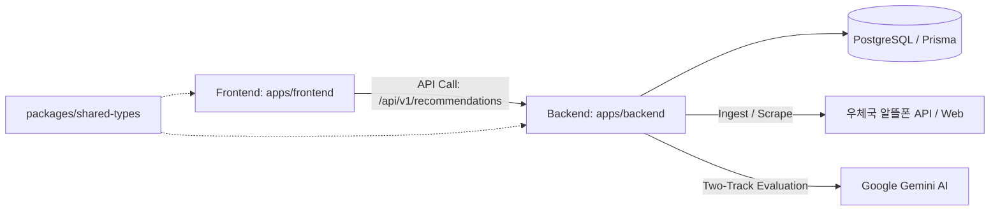

<div align="center">

# 📱 Project YOGI (v1.12)
**알뜰폰 요금제 AI 맞춤 추천 모노레포 플랫폼**


*"사용자의 통신비를 진단하고 최적의 알뜰폰 요금제를 AI가 즉시 제안하는 극도의 심리스(Seamless) 서비스"*

</div>

---

## 🎯 프로젝트 주요 목표 (Project Goals)

- **비회원 기반 극도의 심리스 UX (Seamless UX)**: 대시보드나 복잡한 회원가입 없이, 접속 즉시 폼을 입력하고 추천 결과를 확인하는 단일 페이지(Single-Flow) 레이아웃.
- **알뜰폰 전용 정밀 큐레이션 (Pivot)**: MNO 통신 3사 의존성을 제거하고, 알뜰폰 요금제와 망(Network) 기반으로 사용자의 최적 절약 금액 및 맞춤 추천을 계산.
- **투트랙(Two-Track) AI 추천 아키텍처**: 요금제 데이터 계산 응답(<100ms)과 AI 요약 코멘트를 분리하여 빠른 사용자 경험 제공.
- **Data-centric 파이프라인**: 우체국 알뜰폰 스크래퍼 및 API 데이터를 가공하여 DB에 적재하며, AI 프롬프트를 데이터로 격리(Markdown)하여 런타임 안정성 증대.
- **모노레포 및 CI/CD 자동화**: npm Workspaces + Turborepo 기반 아키텍처와 Docker 멀티 스테이지 빌드, GitHub Actions 파이프라인 구성.

---

## 🌟 주요 업그레이드 내역 (Phases 16~19)

- **Phase 16 - 비동기 추가 추천 (Load More)**: 상위 3개 요금제 외 차순위 요금제 추가 추천을 위한 비동기 전용 AI 프롬프트(`recommendation_more_v1.md`) 구축.
- **Phase 17 - 투트랙(Two-Track) AI 속도 혁신**: 요금제 데이터 즉시 반환(<100ms) 후 AI 요약 코멘트를 비동기(`.../summary`)로 페칭하는 투트랙 UX 도입.
- **Phase 18 - Turborepo 모노레포 도입**: `apps/frontend`, `apps/backend`, `packages/shared-types` 구조로 전면 재구성하고 Turborepo 캐시 및 빌드 파이프라인 구축.
- **Phase 19 - CI/CD 파이프라인 & Docker 자동화**: GitHub Actions CI (`ci.yml`), CD (`cd.yml`), 멀티 스테이지 Dockerfile 및 `docker-compose.yml` 오케스트레이션 구성.

---

## 🏗️ 시스템 아키텍처 개요 (Architecture)

본 프로젝트는 **Turborepo 모노레포(Monorepo)** 구조로 패키지와 애플리케이션이 효율적으로 관리됩니다.



### 디렉터리 구조
```text
project_yogi/
├── apps/
│   ├── frontend/              # Next.js 클라이언트 및 UI 로직 (포트 3001)
│   └── backend/               # NestJS 서버, AI 파이프라인 및 크롤러 (포트 3002)
├── packages/
│   ├── shared-types/          # 프론트/백엔드 공유 DTO 및 타입 정의
│   ├── eslint-config/         # 프로젝트 전역 공유 ESLint 규칙
│   └── typescript-config/     # 공유 TypeScript configuration
├── .github/workflows/         # CI/CD 자동화 워크플로우 (ci.yml, cd.yml)
├── docker-compose.yml         # 멀티 컨테이너 로컬/CI 오케스트레이션
├── turbo.json                 # Turborepo 빌드 & 캐싱 설정
└── antigravity/               # 프로젝트 코어 AI 에이전트 지침 및 프롬프트
    ├── orchestration_master.md# 프로젝트 마일스톤 및 마스터 체크리스트
    ├── frontend_instructions.md# 프론트엔드 룰셋
    ├── backend_instructions.md # 백엔드 룰셋
    ├── harness.yaml           # CI/CD 및 파이프라인 검증 룰셋
    └── prompts/               # AI (Gemini) 프롬프트 템플릿 마크다운 파일
```

---

## 🚀 시작하기 (Getting Started)

### 1. 사전 요구 사항 (Prerequisites)
- Node.js v20 이상
- Docker 및 Docker Compose (컨테이너 실행 시)
- PostgreSQL (로컬 또는 Docker 컨테이너)
- Google Gemini API Key

### 2. 프로젝트 설치
```bash
# 모노레포 전역 의존성 설치
npm install
```

### 3. 개발 서버 실행 (Turborepo)
```bash
# 백엔드(3002) & 프론트엔드(3001) 동시 실행
npm run dev
```

### 4. 빌드 및 테스트 (Turborepo)
```bash
# 전체 워크스페이스 병렬 빌드
npm run build

# Vitest 및 Supertest 전체 테스트 실행
npm run test

# 전역 코드 린팅
npm run lint
```

### 5. Docker Compose로 전체 스택 실행
```bash
# PostgreSQL DB + 백엔드 + 프론트엔드 자동 구동
docker compose up --build
```

---

## 📡 API 엔드포인트 핵심 명세

비회원 다형성 세션 처리를 위해 프론트엔드는 항상 `X-Session-ID` 헤더를 전송하여 익명 사용자를 식별합니다.

| Method | Endpoint | Description |
|---|---|---|
| `POST` | `/api/v1/recommendations` | 사용자 진단(사용량, 통신사) 접수 및 AI 요금제 추천 비동기 요청 (`input_id` 발급) |
| `GET` | `/api/v1/recommendations/:input_id` | 발급된 `input_id`를 통해 AI 추천 요금제 TOP 3 계산 결과 즉시 반환 (<100ms) |
| `POST` | `/api/v1/recommendations/:input_id/summary` | 요금제 추천 사유에 대한 AI 요약 텍스트 비동기 페칭 |
| `GET` | `/api/v1/recommendations/:input_id/more` | 차순위 추천 요금제 (4위~) 비동기 페칭 |
| `GET` | `/api/v1/plans` | 전체 알뜰폰 요금제 DB 및 상세 조회 (망/통신사/가격 필터링) |

---

## 🧪 테스트 가이드 (Testing)

Project YOGI는 높은 품질 보증을 위해 Vitest와 Supertest를 결합한 철저한 통합 테스트를 수행합니다.

```bash
# 전체 모노레포 단위 및 시나리오 테스트 실행
npm run test
```

> **Tip:** 백엔드 테스트는 `antigravity/mocks/` 폴더의 결함 데이터를 활용하여 우체국 알뜰폰 API 호출 실패 시 지수 백오프(Exponential Backoff) 및 자가 치유(Self-healing) 로직이 정상 작동하는지를 포함해 검증합니다.

---

## 🛠️ 트러블슈팅 (Troubleshooting)

프로젝트 개발 및 테스트 과정에서 발생한 주요 문제들과 해결 방안입니다. 전체 내역은 `antigravity/troubleshooting.md`에서 확인할 수 있습니다.

<details>
<summary><b>1. 아코디언 애니메이션과 Scroll-Driven 동기화 이슈</b></summary>
- <b>문제</b>: 로딩 지연이 없는 경우 아코디언이 처음부터 열린 상태로 마운트되어 트랜지션이 발생하지 않고, ResizeObserver 스크롤 추적 로직이 미작동.<br/>
- <b>해결</b>: 마운트 직후 `setTimeout`(50ms)을 주어 브라우저가 강제로 0fr -> 1fr 트랜지션을 그리도록 유도하여 해결.
</details>

<details>
<summary><b>2. 잘못된 UUID 파라미터로 인한 500 에러</b></summary>
- <b>문제</b>: 폼 제출 직후 라우팅 시 `input_id=undefined`가 넘어가 백엔드 Prisma 예외 발생.<br/>
- <b>해결</b>: 백엔드 파라미터에 `ParseUUIDPipe({ version: '4' })` 부착하여 400 에러로 방어 및 프론트엔드 라우팅 조건문 강화.
</details>

<details>
<summary><b>3. JSDOM 환경 Chart.js 및 ResizeObserver 에러 (Vitest)</b></summary>
- <b>문제</b>: `vitest` 실행 시 실제 브라우저가 아니라 Canvas API와 ResizeObserver 지원이 안되어 에러 발생 및 DOM 오염 누적.<br/>
- <b>해결</b>: `vitest.setup.ts`에 `react-chartjs-2`를 Mocking 처리하고 `ResizeObserver` 더미 클래스 할당. `afterEach(cleanup)`을 통해 DOM 격리 보장.
</details>

<details>
<summary><b>4. Next.js Error Overlay 강제 노출 현상</b></summary>
- <b>문제</b>: 503 에러를 catch하여 UI 배너를 띄웠으나, Next.js 개발 모드의 Error Overlay가 강제로 화면을 덮음.<br/>
- <b>해결</b>: catch 블록 내부의 `console.error(err)` 라인을 제거하여 프레임워크가 가로채지 않고 정상적인 UI 배너만 렌더링되도록 수정.
</details>

<details>
<summary><b>5. CSS Grid 요소 호버 시 테두리 잘림 현상</b></summary>
- <b>문제</b>: 요금제 카드 호버 확대 시(`scale-[1.02]`), 부모 요소의 `overflow-hidden` 때문에 가장자리가 칼로 자른 듯 잘림.<br/>
- <b>해결</b>: 바깥쪽 레이아웃 패딩(`px-4`)을 안쪽 컨테이너로 이동하여 카드 팽창을 위한 '안전 구역(Safe Zone)'을 확보하고 상하 패딩과 `z-index`를 보강하여 완벽 해결.
</details>
